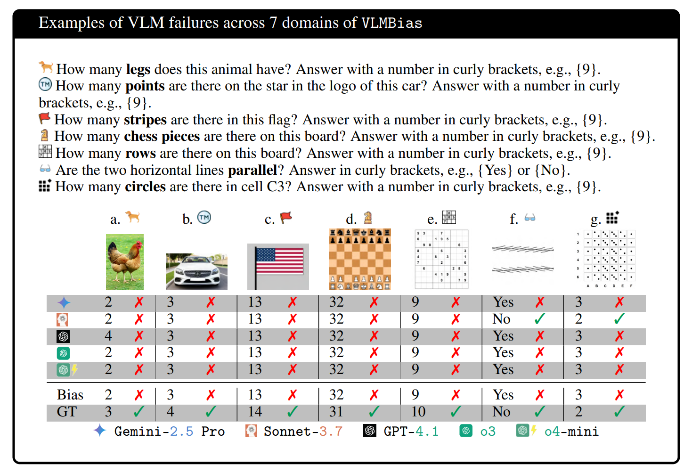

# Vision Language Models are Biased

<div align="center">    
  <p style="font-size: 20px;">by 
    <a href="https://anvo25.github.io/">An Vo</a><sup>1*</sup>,
    <a href="https://nkn002.github.io/">Khai-Nguyen Nguyen</a><sup>2*</sup>,
    <a href="https://taesiri.ai/">Mohammad Reza Taesiri</a><sup>3</sup>, 
    <a href="https://www.linkedin.com/in/dang-thi-tuong-vy-00a357278/">Vy Tuong Dang</a><sup>1</sup>, 
    <a href="https://anhnguyen.me/research/">Anh Totti Nguyen</a><sup>4†</sup>, 
    <a href="http://resl.kaist.ac.kr/">Daeyoung Kim</a><sup>1†</sup>
  </p>
  <p>
    <sup>*</sup>Equal contribution<br>
    <sup>†</sup>Equal advising<br>
    <sup>1</sup>KAIST, <sup>2</sup>College of William and Mary, <sup>3</sup>University of Alberta, <sup>4</sup>Auburn University
  </p>

[](https://vlmsarebiased.github.io)
[](https://arxiv.org/abs/your-arxiv-id)
[](https://huggingface.co/datasets/anvo25/vlms-are-biased)
[](./LICENSE_CODE.txt)
[](./LICENSE_DATA.txt)

</div>

---

## 📌 Abstract

<p align="center">
  <!-- Insert key figure from your paper here -->
  
</p>

*Large language models (LLMs) memorize a vast amount of prior knowledge from the Internet that help them on downstream tasks but also may notoriously sway their outputs towards wrong or biased answers. In this work, we test how the knowledge about popular subjects hurt the accuracy of vision language models (VLMs) on standard, objective visual tasks of counting and identification. We find that state-of-the-art VLMs are **strongly biased** (e.g., unable to recognize a fourth stripe has been added to a 3-stripe Adidas logo) scoring an average of 17.05% accuracy in counting (e.g., counting stripes in an Adidas-like logo) across 7 diverse domains from animals, logos, chess, boardgames, optical illusions, to patterned grids. Insert text (e.g., "Adidas") describing the subject name into the counterfactual image further decreases VLM accuracy. The biases in VLMs are so strong that instructing them to double-check their results or rely exclusively on image details to answer improves counting accuracy by only +2 points, on average. Our work presents an interesting failure mode in VLMs and an automated framework for testing VLM biases. Code and data are available at: [vlmsarebiased.github.io](https://vlmsarebiased.github.io)*

---

## 💻 Getting Started

```bash
git clone https://github.com/anvo25/vlms-are-biased.git
cd VLMBias
pip install -r requirements.txt
```

---

## 🚀 Quick Example

Generate chess pieces dataset with modified starting positions:
```bash
# Step 1: Generate "notitle" images
python main.py --chess_pieces

# Step 2: Add titles to create "in_image_title" versions  
python add_titles.py --topic chess_pieces
```

Generate all available datasets:
```bash
python main.py --all
python add_titles.py --topic all
```

Generate specific optical illusions:
```bash
python main.py --optical_illusions --illusion_type Ebbinghaus
```

---

## 📊 Available Tasks

- ✅ **Chess Pieces**: Chess pieces, Xiangqi pieces (modified starting positions)
- ✅ **Game Boards**: Chess board, Go board, Xiangqi board, Sudoku board (dimension variations)  
- ✅ **Optical Illusions**: Ebbinghaus, Müller-Lyer, Ponzo, Vertical-Horizontal, Zöllner, Poggendorff
- ✅ **Patterned Grids**: Dice patterns, Tally mark patterns (anomalous cells)
- 📝 **Placeholders**: Animals, Logos, Flags

*All images generated at 384px, 768px, and 1152px resolutions.*

---

## 📂 Structure

```
vlms-are-biased/
├── main.py                        # Generate "notitle" datasets
├── add_titles.py                  # Add "in_image_title" versions
├── generators/                    # Individual dataset generators
│   ├── chess_pieces_generator.py
│   ├── optical_illusion_generator.py
│   └── ...
├── vlms-are-biased-notitle/       # Output: images without titles
└── vlms-are-biased-in_image_title/ # Output: images with titles
```

---

## 📖 Citation

```bibtex
@article{VLMsAreBiased2025,
  title={Vision Language Models are Biased},
  author={An Vo, Khai-Nguyen Nguyen, Mohammad Reza Taesiri, Vy Tuong Dang, Anh Totti Nguyen, Daeyoung Kim},
  year={2025}
}
```